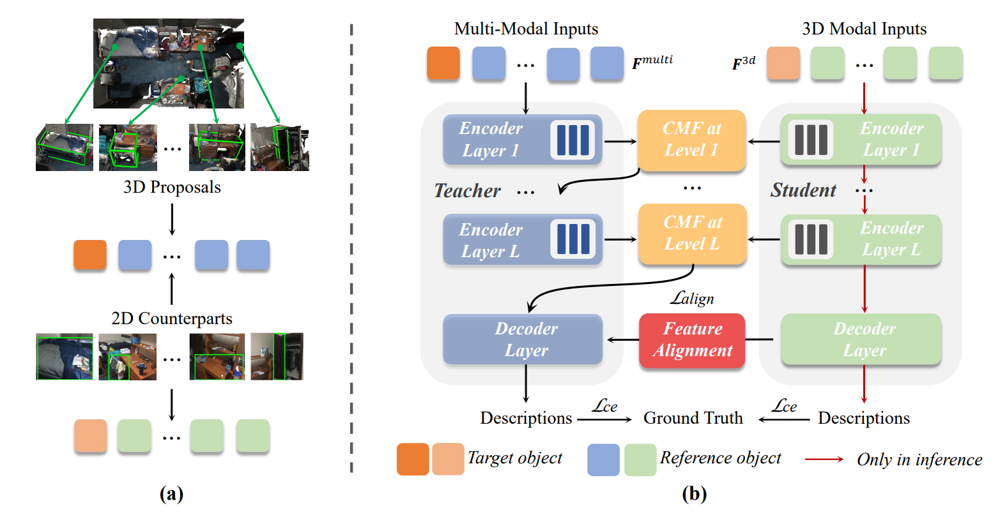

# X-Trans2Cap
**[CVPR2022]** X-Trans2Cap: Cross-Modal Knowledge Transfer using Transformer for 3D Dense Captioning [[Arxiv Paper]](https://arxiv.org/abs/2203.00843)

Zhihao Yuan, [Xu Yan](https://github.com/yanx27), Yinghong Liao, Yao Guo, Guanbin Li, Shuguang Cui, [Zhen Li*](https://mypage.cuhk.edu.cn/academics/lizhen/)


## Citation

If you find our work useful in your research, please consider citing:
```bibtex
@inproceedings{yuan2022x,
  title={X-Trans2Cap: Cross-Modal Knowledge Transfer using Transformer for 3D Dense Captioning},
  author={Yuan, Zhihao and Yan, Xu and Liao, Yinghong and Guo, Yao and Li, Guanbin and Li, Zhen and Cui, Shuguang},
  booktitle={Proceedings of the IEEE/CVF Conference on Computer Vision and Pattern Recognition},
  year={2022}
}
```

## Prerequisites
* Python 3.6.9 (e.g., conda create -n xtrans_env python=3.6.9)
* Pytorch 1.7.1 (e.g., conda install pytorch==1.7.1 cudatoolkit=11.0 -c pytorch)
* Install other common packages (numpy, [transformers](https://huggingface.co/docs/transformers/index), etc.)

## Installation
- Clone the repository

    ```
    git clone https://github.com/CurryYuan/X-Trans2Cap.git
    ```

- To use a PointNet++ visual-encoder you need to compile its CUDA layers for [PointNet++](http://arxiv.org/abs/1706.02413):
```Note: To do this compilation also need: gcc5.4 or later.```
    ```
    cd lib/pointnet2
    python setup.py install
    ```

## Data

### ScanRefer

If you would like to access to the ScanRefer dataset, please fill out [this form](https://forms.gle/aLtzXN12DsYDMSXX6). Once your request is accepted, you will receive an email with the download link.

> Note: In addition to language annotations in ScanRefer dataset, you also need to access the original ScanNet dataset. Please refer to the [ScanNet Instructions](data/scannet/README.md) for more details.

Download the dataset by simply executing the wget command:
```shell
wget <download_link>
```

Run this commoand to organize the ScanRefer data:
```bash
python scripts/organize_data.py
```

### Processed 2D Features
You can download the processed 2D Image features from [OneDrive](https://cuhko365-my.sharepoint.com/:u:/g/personal/221019046_link_cuhk_edu_cn/EYoVKnDvr89OoWstNIK2aDEBWjBmxAovQjg6bP34xZ3j2w?e=zvGRom). The feature extraction code is borrowed from [bottom-up-attention.pytorch](https://github.com/MILVLG/bottom-up-attention.pytorch).

Change the data path in `lib/config.py`.

## Training

Run this command to train the model:

```bash
python scripts/train.py --config config/xtrans_scanrefer.yaml
```

Run CIDEr optimization:
```bash
python scripts/train.py --config config/xtrans_scanrefer_rl.yaml
```
